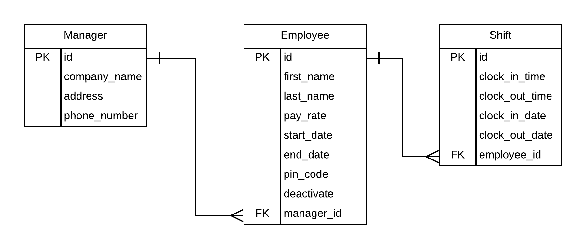

# Welcome to Shift Tally
> A Python Django web app that allows managers to create an employee profile and allow employees to record their working hours.

## Background
Throughout my twenties I worked for different coffee shops and other small businesses. I noticed in most of these positions the owner didn't have a good resource for tracking employee hours. Most of the businesses had employees record their own hours and turn them in from an excel sheet or text message. I wanted to create an better option for small business owners to keep track of employee hours.

## General App Functionality
The following functionalities are part of Shift Tally:

1. User registration (forked from Steve and Joe - thanks! ;) )
1. User login (forked from Steve and Joe)
1. User logout (forked from Steve and Joe)
1. Employee: add, edit, detail, list
1. Shifts: add, edit, delete, list

## App Flow
This app has 4 goals:
1. Track employee information
1. Track employee worked shifts
1. Track employee employment status (active or inactive)
1. Allow employees to easily clock in using their pre-assigned pin code

Typical flow:

1. Manager creates new employees
1. An employee can enter their given pin code into the affordance to clock in or out
1. Manager can check your dashboard to see which active employees are currently clocked in or not
1. Manager edits employee details
1. Manager can edit/delete employee shifts
1. Manager marks an employee inactive 

## ERD

## To Clone
1. Create a directory
1. cd into that directory
1. Clone the repository
1. Start a virtual environment
1. Run `pip install django`
1. Create migrations `python manage.py makemigrations website`
1. Apply migrations to db `python manage.py migrate`
1. run `python manage.py runserver`
1. Open up your browser and navigate to the running server
1. Register, add employee, and now that employee can clock in & out with the pin code you provided

## Created by Samuel Webber
I'm a graduate of [Nashville Software School](http://nashvillesoftwareschool.com/) 
Learn more about me at [samuelwebber.com](http://www.samuelwebber.com/)

